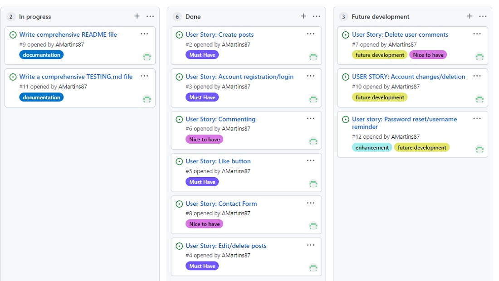
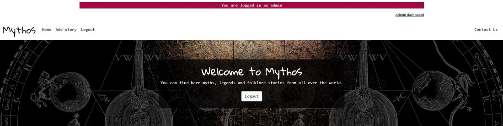
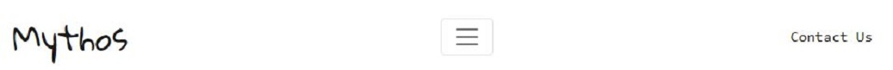
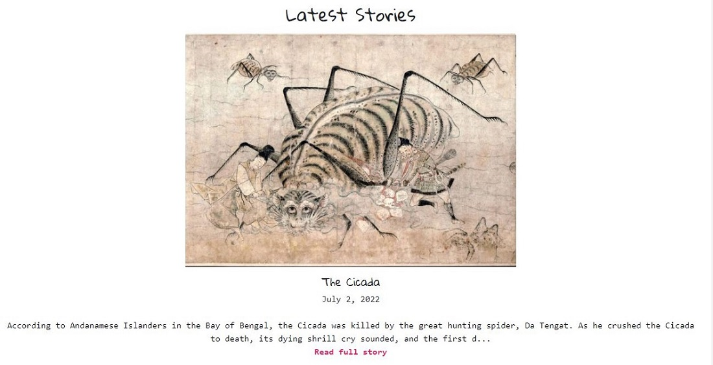
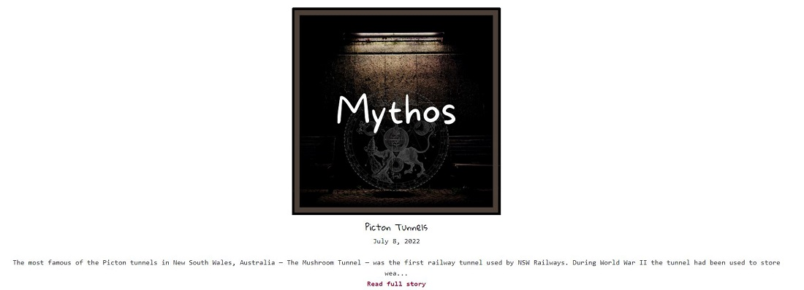
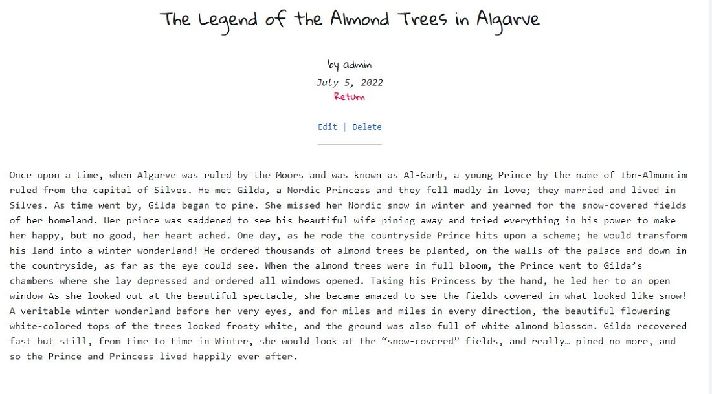
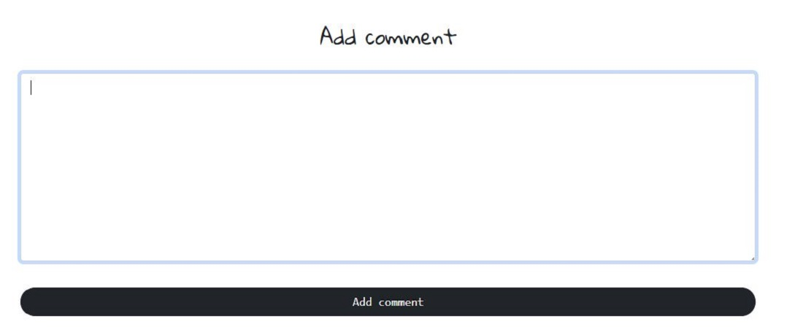

# **INTRODUCTION**

Mythos is a full-stack framework project built using Django, Python, HTML, and CSS. It's a blog-style website where users can read about local myths and legends from all over the world. The objective is for users to be allowed to post, like, and comment on blog posts.

Live project can be found [here](https://mythoi.herokuapp.com/).

*Please press **Ctrl** in Windows or **Command** on Mac button and click for any links which you would like to open in a new tab when in the README.md file*

# **USER EXPERIENCE**
## **USER STORIES**

As a site user and site admin, I want to be able to login/logout of my account so I can interact with the site’s posts and users.

## **External user’s goal:**
## *As a site user:*
- I can click on a post so I can read it in full
- I want to be able to write my own posts and comment on other stories so I can exchange opinions and ideas with other users and the blog owner. This attracts more traffic and makes the site social
- I want to be able to like posts so I can show the users and site admin I have liked their content

## **Site owner's goal:**
## *As a site admin:*
- I can create/publish new posts so that I can keep the blog updated and relevant to its purpose
- I can edit/delete posts so I can correct typos or incorrect information which I may have provided

# **Agile planning**
The development of this project was managed and implemented using GitHub project Kanban board and can be located [**here**](https://github.com/AMartins87/mythos/projects/1).

User stories were labeled as **Must Have**, **Nice to have**, and later I created **future development** label. Documentation like README and TESTING md files were assigned **documentation** label.

## **Future development**

As listed on my Kanban board, I'd to implement a few new features in the future. One of them is the password and username reset function in case the site users forget these.

I would like for users to be able to amend their account details as well as be able to delete their accounts.

And lastly, I would also like to be able to delete user comments if they would against published community guidelines.

---

# **FEATURES**
## **Main Page**
- Navbar (on every page for ease of navigation)
    - Add Story
    - Register
    - Login
    - Contact Us

**Hero image with welcome text box and register/login button**

**Navbar and hero image with welcome text box and logout button (after user login)**

**Navbar and hero image with welcome text box and logout button (after admin login)**

**Navbar with collapsible menu icon for screens with a width of 991px or less**

    
**Footer**
- Copyright information
- Social media links for YouTube, Twitter, Facebook

## Latest stories

**Latest stories** section where are all stories' previews with uploaded images and they show up in list order, in descending order from the latest uploaded posts to the oldest ones, with  ***Read full story*** click-through link which will take the user to the full story

If users don't upload their own images, an image will feed through from Cloudinary as a placeholder

Page with the full view of the story as a user

Page with the full view of the story as an author which shows *edit* and *delete* links underneath the author's name & date of posting

## **Add story page**

If users are not logged in it will redirect them to the login page before they can add a story.

Otherwise, users are taken to the correct page immediately. They must fill in **title**, add **story** text, and can choose to upload an image if they wish so. This image is then saved to my Cloudinary database

## **Add comment page**

Comments can be only left if users are registered and logged in

Once logged in, the page requires only a comment input

## **Delete post page**

Users are shown the title of the story to be deleted and asked if they are sure to delete and two buttons are shown - *Delete* and *Go back* which will take the user back to the home page

## **Contact page**

Users can contact the site administrator by filling in the simple form on the screen where they are required to give their **name**, **email address**, **subject** and then type in their **message**

# **Wireframes**
Wireframes were created using Balsamiq.

---

# **TESTING**
See all testing documentation **[here](/TESTING.md)**.

--- 

# **BUGS**
## **Fixed bugs**

1. When I returned after my study break I had to reinstall all the Django libraries and packages which I have all successfully installed. I had to contact Tutor Support as I wasn't sure where the issue was. 
It was a very simple fix - I forgot to recreate a new *env.py* file. 
2. When trying to open up the browser with the command *python3 manage.py runserver*, there was an error coming up. As I haven't made any changes since I worked on the project the previous night and all worked then, I decided to contact **Tutor Support** as the error was completely unknown to me. Again this was an easy fix, as Heroku has run updates and I had to only copy over a new **DATABASE_URL** into my *env.py* file.

    

3. After creating a model for adding posts and installing ckeditor, I tried to migrate but it was coming up with an error message and my page has crashed as well. 
    - I reverted all migrations I made till this point, using a command *./manage.py migrate blog zero*, then I proceeded with *python manage.py makemigrations > python manage.py migrate* and all was ok then.

        
        

4. During the final testing I found out my collapsible menu icon is not opening up the menu on smaller screens. The issue got fixed by reverting from Bootstrap version 5.1.3 to 4.3.1. 

## **Unfixed bugs**

No known unfixed bugs.

---

# **DEPLOYMENT**
This project was created on GitHub and deployed to Heroku.

## **Following steps were taken in the deployment of this project:**

1.  Using the CI full template, a new repository was created and named Mythos
2.  When in the new repository, the following Django packages and supporting libraries were installed by using the command ***pip3 install***: **Gunicorn, Psycopg, Cloudinary**.
3.  *Requirements.txt* file was created and updated
4.  Project and app were created, the app was added to my ***settings.py*** file in INSTALLED_APPS section
5.  First migration and testing of the server
6.  After the first migration, a new app was created in Heroku, add-on of Postgres database was added to app resources
7.  Database attachment in GitPod by creating ***env.py*** and adding Postgres database link, SECRET_KEY, and my Cloudinary link
8.  Entered Secret Key, Cloudinary, and Postgres database to Config Vars in Heroku
9.  Created templates, media, and static files on the top level of the directory
10.  Created **Procfile** and added my gunicorn code
11.  All changes added with add, commit, and push commands in Github
12. Deployed content manually through Heroku by going to *Deploy* tab, connected my **GitHub** account and found my repository, and connected it with **Heroku**
13. Pressed *Enable Automatic Deploys* and then pressed *Deploy Branch* button. Once this was finished, I opened my app to check all works

--- 

# **CREDITS**
## **MEDIA**

**Hero image** on the home page was created by me in [Canva](canva.com)
**Placeholder image** which is used as a placeholder image when users don't upload their own was created by me in [Canva](canva.com)

**README main image** was screenshotted from [Am I Responsive](https://ui.dev/amiresponsive?url=https://mythoi.herokuapp.com/)

[Cicada story image](https://www.dailyartmagazine.com/hero-mythical-creatures-spiders-in-art/) - Tsuchigumo emaki, second-generation copy of the handscroll painting from Tosa Nagataka School

[The Legend of the Almond Trees in Algarve](https://pixels.com/featured/tunnel-thru-blooming-almond-trees-sheila-fitzgerald.html) by Sheila Fitzgerald, Pixels

[Slender Man](https://villains.fandom.com/f/t/Slender%20Man) - no author provided for this iamge

## **ACKNOWLEDGMENT**

### **Code Institute**
- For providing the basic structure via the walkthrough project Codestar for my blog project

### **[Tutor Support](https://learn.codeinstitute.net/ci_support/diplomainsoftwaredevelopmentecommerce/tutor)**
- For helping with restarting my project and helping me found the core of the issue
- For guiding me on how to fix a bug when my project didn't want to open up

### **[Django documentation](https://docs.djangoproject.com/en/4.0/)**
- I relied heavily on this page during the development of my project

### **[Stack Overflow](https://stackoverflow.com/)**
- I searched for quite a few styling issues I was facing when trying to adjust the standard Bootstrap shell look. I have always found an answer/solution on there when I couldn't find a solution on the Bootstrap site

### **[Bootstrap](https://getbootstrap.com/docs/5.0)**
- Thank you for providing the basic styling for my project

### **[Geeks for Geeks](https://www.geeksforgeeks.org/form-as_p-render-django-forms-as-paragraph/)**
- This helped me to simplify all forms used in my project

### **[W3Schools](https://www.w3schools.com/)**
- Thank you for helping me with implementing an image text block on my home page