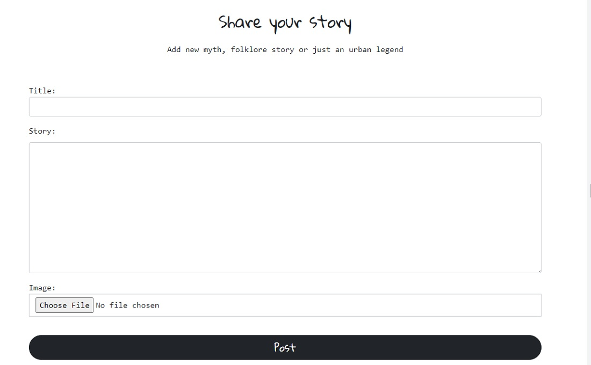

# INTRODUCTION 

Mythos is full-stack framework project built using Django, Python, HTML and CSS. It's a blog-style website where users can read about local myths and legends from all over the world. The objective is for users to be allowed to post, like and comment on blog posts.

Live project can be found [here](https://mythoi.herokuapp.com/).

*Please press **Ctrl** in Windows or **Command** on Mac button and click for any links which you would like to open in a new tab when in the README.md file*

# USER EXPERIENCE
## USER STORIES

As a site user and site admin I want to be able to login/logout of my account so I can interact with the site’s posts and users

# External user’s goal:
## *As a site user:*
- I can click on a post so I can read it in full.
- I want to be able to write my own posts and comment on other stories so I can exchange opinions and ideas with other users and the blog owner. This attracts more traffic and makes the site social.
- I want to be able to like posts so I can show the users and site admin I have liked their content.

# Site owner's goal:
## *As a site admin:*
- I can create/publish new posts so that I can keep the blog updated and relevant to its purpose
- I can edit/delete posts so I can correct typos or incorrect information which I may have provided

# AGILE
The development of this project was managed and implemented using GitHub Project Kanban Board.

# FEATURES 
## Main Page
- Navbar (on every page for ease of navigation)
    - Add Story
    - Register
    - Login
    - Contact Us
- Hero image with welcome text box and register/login button

- Navbar and hero image with welcome text box and logout button (after user login)

- Navbar on small screens with collapsible menu icon

    
- Footer
    - Copyright information
    - Social media links for YouTube, Twitter, Facebook

## Latest stories

- Latest stories section where all story previews with uploaded image show up in list order with  ***Read full story*** click through link which will take the user to the full story

- If users don't upload their own images, an image will feed through from Cloudinary as a placeholder

- Page with the full view of the story as an user

- Page with the full view of the story as an author which shows *edit* and *delete* links underneath the author's name & date of posting

## Add comment page

## Add story page

- If users are not logged in it will redirect them to login page before they can add a story
- Otherwise users are taken to the correct page immediately. They must fill in **title**, add **story** text and can choose to upload an image if they wish so. This image is then saved to my Cloudinary database

## Delete post page

- Users are shown title of the story to be deleted and asked if they are sure to delete and two buttons are shown - *Delete* abd *Go back* which will take the user back to home page

## Contact page

- Users can contact the site administrator by filling in simple form on screen where they are required to give their **name**, **email address**, **subject** and then type in their **message**

# Wireframes
Wireframes were created using Balsamiq.

## TESTING
# Manual Testing

# Validator Testing

-   **HTML** (No errors were returned when passing through the official W3C validator) 
    

-   **CSS** (No errors were found when passing through the official Jigsaw validator)
    

-   **PEP8** (All python code was checked via [PEP8](http://pep8online.com/) with no errors reported.)
    

## BUGS
# Fixed bugs
After creating a model for adding posts and installing ckeditor, I tried to migrate but it was coming up with an error messages and my page has crashed as well. 

I reverted all migrations I made till this point, using a command *./manage.py migrate blog zero*, then I proceeded with *python manage.py makemigrations > python manage.py migrate* and all was ok then. 

During the final testing I found out my collapsible menu icon is not opening up the menu on smaller screens. The issue got fixed by reverting from Bootstrap version 5.1.3 to 4.3.1. 

## Unfixed bugs

## DEPLOYMENT
This project was created in GitHub and deployed to Heroku. 

### Following steps were taken in deployment of this project: 

1.  Using the CI full template, new repository was created and named Mythos
2.  When in the new repository, following Django packages and supporting libraries were installed by using the command *pip3 install* : **Gunicorn, Psycopg, Cloudinary**.
3.  *Requirements.txt* file was created and updated
4.  Project and app were created, app was added to my *settings.py* file into INSTALLED_APPS section
5.  First migration and testing of the server
6.  After the first migration, new app was created in Heroku, add-on of Postgres database was added to app resources
7.  Database attachment in GitPod by creating *env.py* and adding Postgres database link, SECRET_KEY and my Cloudinary link
8.  Entered Secret Key, Cloudinary and Postgres database to Config Vars in Heroku
9.  Created templates, media and static files on top level of the directory
10.  Created Procfile and added my gunicorn code
11.  All changes added with add, commit and push commands in Github
12. Deployed content manually through Heroku 

## CREDITS

https://www.w3schools.com/ 
https://getbootstrap.com/docs/5.0
https://docs.djangoproject.com/en/4.0/
https://www.geeksforgeeks.org/form-as_p-render-django-forms-as-paragraph/

Images
https://unsplash.com/photos/GtTNR-nxbK4 - mermaid by Naja Bertolt Jensen, Unsplash

https://www.pexels.com/photo/low-angle-view-on-person-wearing-costume-of-ancient-god-9969537/ - Person with facemask by Amar Preciado, Pexels

https://www.pexels.com/photo/the-trojan-horse-6474435/ - Trojan horse by KEMAL HAYIT, Pexels

https://www.dailyartmagazine.com/hero-mythical-creatures-spiders-in-art/ - spider

https://pixels.com/featured/tunnel-thru-blooming-almond-trees-sheila-fitzgerald.html - almond trees
