# **MYTHOS - TESTING**

Testing.md document records all reports from validators and gives a brief summary of manual testing which got carried out.

# **Manual Testing**

I have tested the site functionality and created couple of normal user accounts during this process. 

## **1. Menu/navbar links**
### **Purpose: Test if all present link take users to the correct pages**

These were tested by clicking on each navigation link from each page. 
All links directed to the correct pages as expected.

---

## **2. Registration & Login**
### **Purpose:Test if users can register to the website**

1. Enter [Mythos website](https://mythoi.herokuapp.com/) and click on [**Register** link](https://mythoi.herokuapp.com/users/register/) in navbar or **Register** link in Welcome text box over hero image

    

2. Write in username, first and last name, email, passowrd and again password to confirm. Then click *Register* button

    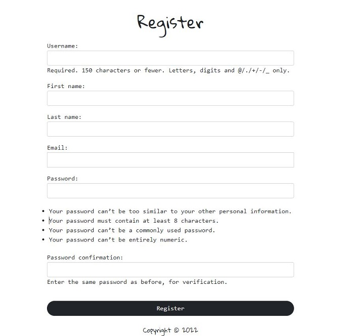

3. Once user clicks on register button, they will be taken **Login page** to login with their new login details

4. User is successfully logged and redirected to home page

---

## **3. Logout**
### **Purpose: Test if users can logout of their account**

1. Login to [Mythos](https://mythoi.herokuapp.com/)
2. Navbar and welcome text box will change their links from Login / Register to **Logout**
3. Click on **Logout**

    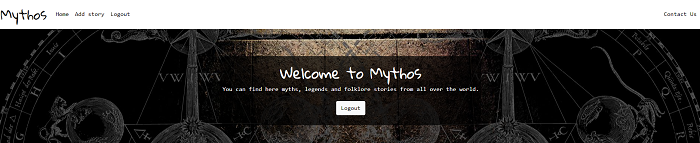

4. User is successfully logged out and redirected to home page

---

## **4. New blog post/story**
### **Purpose: Test if users can add a new blog post**

1. Click on [**Add story**](https://mythoi.herokuapp.com/new-post/)
2. If users not logged in, they will be redirected to **Login** page
3. If users logged in, they will be taken to *Share your story* page where they will have to fill in *Title* of the story and the *Story* itself. There is also an option to upload an image which will be saved onto admin Cloudinary account if users choose to upload their own image to the post.

    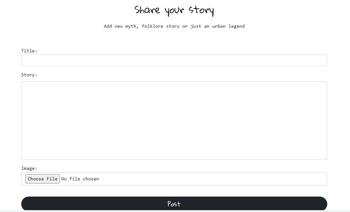

---

## **5. Comment on blog post**
### **Purpose: Test if users can comment on posted stories**

1. If users want to comment on any posted story, they need to click on **Read full story** link and scroll to the bottom of the page to see the **Comment** section and click on **Add comments**

    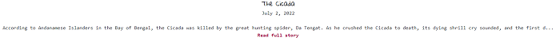

    

2. Once clicked on, users will be redirected to **comment page**. 

    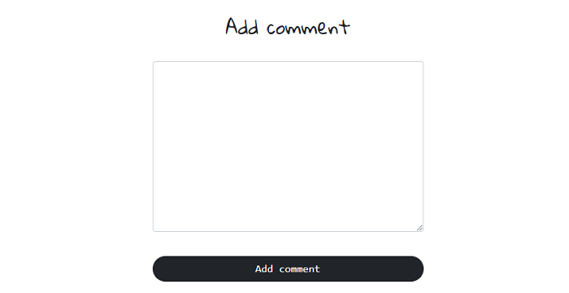

3. For users to be able to comment, they need to be registered and logged in

    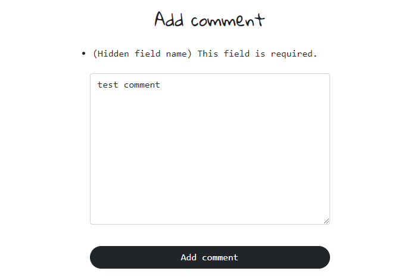

4. Once user clicks on **Add comment** button, they will be redirected back to **Home** page 

5. Comments appear as per below image under each post 

    

---

## **6. Like button testing**
### **Purpose: Test if like button works**

1. If users are not logged in, the like button won't show on the screen, only number of give likes

    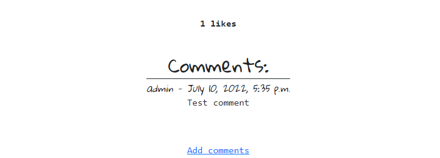

2. If users are logged in, the like button will show on the screen above the **comment** section

    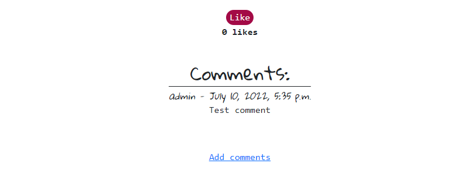

3. By clicking on the **Like** button, the like number will either increase or decrease if clicked again by the same user

    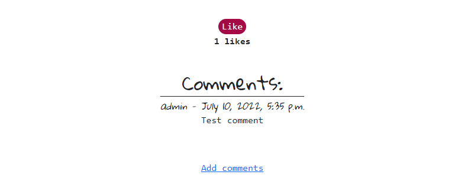

---

## **7. Update blog post**
### **Purpose: Test if posts can be amended once uploaded**

1. To be able to edit a post, author has to be logged in to their account
2. Once logged in, they have to click on **Read full story** link on their blog post where **Edit** link will appear below the post title and date of posting

    

3. Once clicked, users will be redirected to **Update post page** where author can amend the title or the story text

    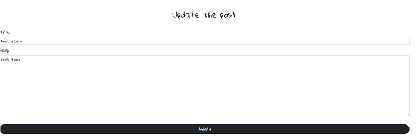

4. Once author clicks the **Update** button, they will be redirected to **Home** page

---

## **8. Delete blog post**
### **Purpose: Test if posts can be deleted**

1. To be able to delete a post, author has to be logged in to their account
2. Once logged in, they have to click on **Read full story** link on their blog post where **Delete** link will appear below the post title and date of posting

    
  
3. Once clicked, users will be redirected to **Delete post page** where author will be asked if they are sure they want to delete the post and given a choice of **Delete** button or **Go back** which would take them back to **Home** page

    

---

## **9. Contact form**
### **Purpose: Test if users can successfully contact the site administrator via the Contact link**

1. Click on [**Contact Us**](https://mythoi.herokuapp.com/contact/) link in navbar
2. Users, both registered and not, can use the contact form by filling all the required details - Name, email, reason of their contact and then the message text
    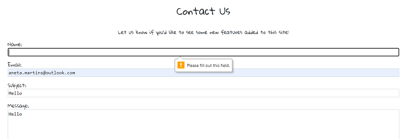
    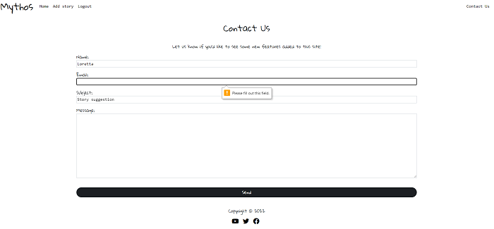
    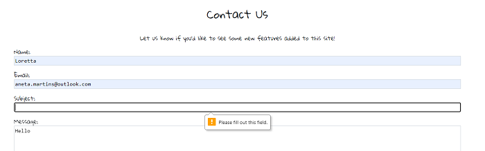
    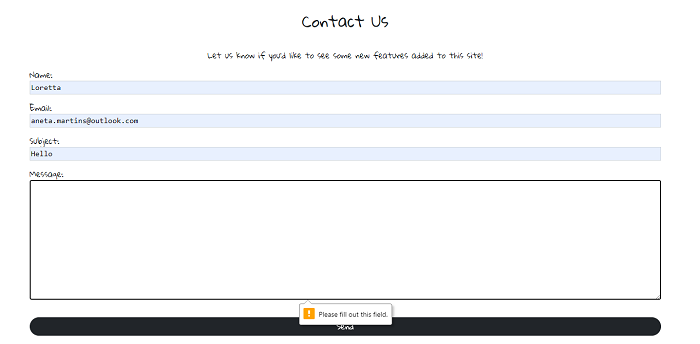

---

## **10. Footer**
### **Purpose: Test if all social media links take users to their respective links and open in new windows**

These were tested by clicking on each social media icons. 
All of these opened respective social media sites in new windows as expected.

---

All of these tests were performed on desktop PC, Dell laptop and iPhone8, iPhone 8, iPhone 12 and iPad Pro and worked as planned. The app was responsive and very easy to navigate.

### SUMMARY OF ALL TESTS 
- Menu links tested
- Login and registration
- Added a post with and without an image
- Edited and deleted a post as an author
- Commented on a post
- Used the like button
- Filled in the contact form 
- Tested all footer social media links

---

# Validator Testing

## **HTML**
- No errors were returned when passing through the official W3C validator

    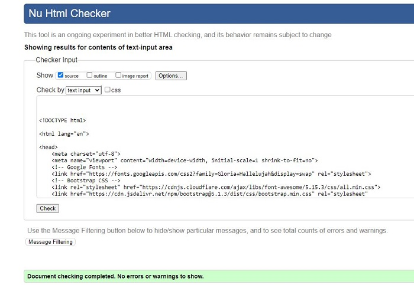

## **CSS**
- No errors were found when passing through the official Jigsaw validator

    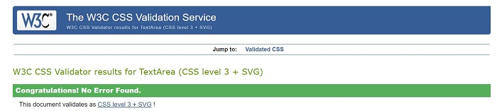

## **PEP8**
- All python code was checked via [PEP8](http://pep8online.com/) with no errors reported.)
    
  ### **Blog app**
  #### **admin.py**
  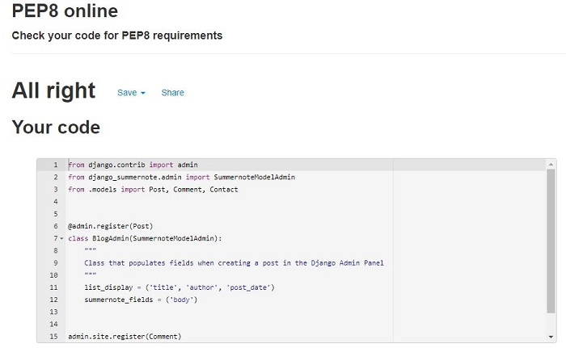

  #### **forms.py**
  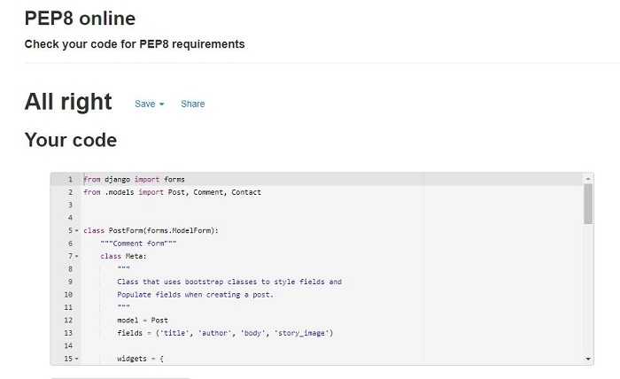

  #### **models.py**
  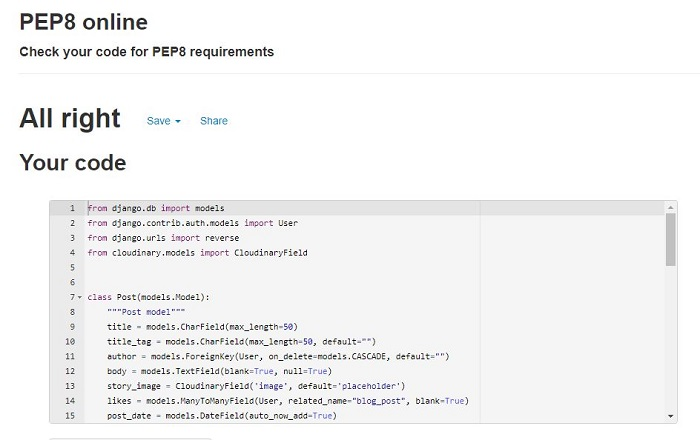

  #### **urls.py**
  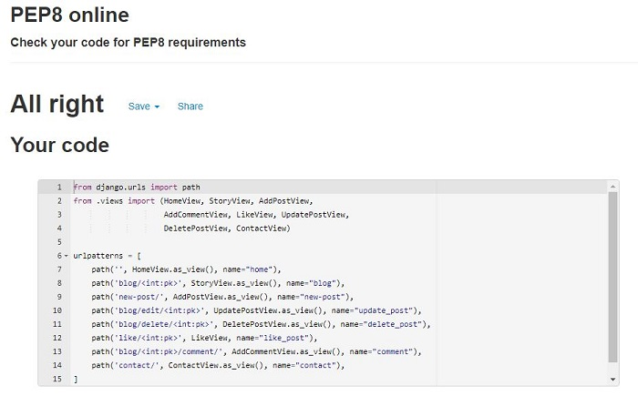

  #### **views.py**
  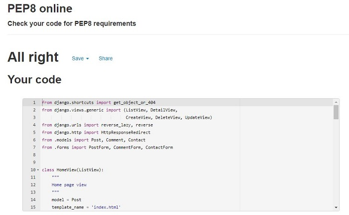

# Accessibility

I checked that the chosen colors and fonts are easy to read. All pages have passed through the Lighthouse reporting tool in Chrome developer tools on both mobile and desktop.

- [Contrast checker - body text](media/testing/validators/contrast_checker_text.JPG)
- [Contrast checker - links](media/testing/validators/contrast_checker_links.JPG)
- [Contrast checker - hover selector](media/testing/validators/contrast_checker_hover.JPG)

---

## **Lighthouse Testing**

  ### **Desktop**
  
  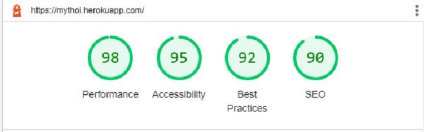

  ### **Mobile**
  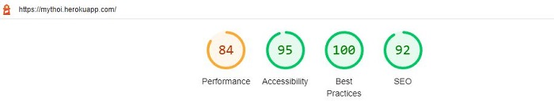

